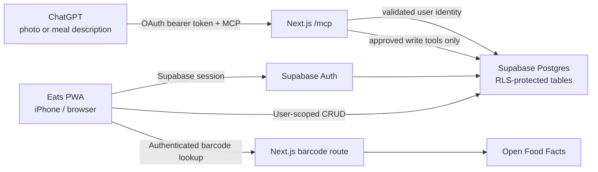
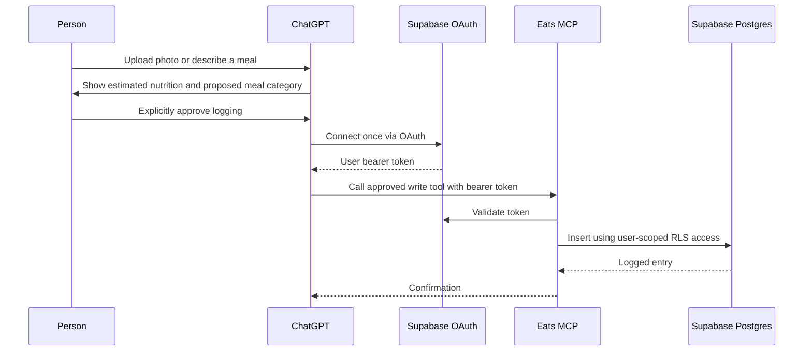

<p align="center">
  <picture>
    <source media="(prefers-color-scheme: dark)" srcset="public/eats-logo-white.png" />
    <source media="(prefers-color-scheme: light)" srcset="public/eats-logo.png" />
    
  </picture>
</p>

<h1 align="center">Eats</h1>

<p align="center">A premium, mobile-first nutrition tracker with private Supabase sync and a ChatGPT MCP connection.</p>

## Overview

Eats lets a person log food, save ingredients and reusable meals, scan barcodes, and keep nutrition history private to their account. It is designed as an iPhone-friendly Progressive Web App (PWA), with an optional ChatGPT connection for reviewing a food photo or written meal description before it is saved.

ChatGPT estimates nutrition; Eats remains the system of record. Nothing is written by the AI until the person clearly approves the proposed entry.

## Highlights

- iOS-inspired, installable PWA with an in-app **Sync** control
- Daily calories, protein, carbohydrates, and fat, including historical dates
- Personal ingredient, saved-meal, and routine library
- Barcode capture using the Open Food Facts database
- Password-free email-code authentication
- Private cloud sync enforced by Supabase Row Level Security (RLS)
- MCP tools for ChatGPT to inspect goals and logs, build a personal food library, and log only user-approved meals

## Technology

| Area | Technology | Purpose |
| --- | --- | --- |
| App | Next.js 16, React 19, TypeScript | PWA user interface, server routes, and deployment build |
| Styling and UI | CSS, Lucide icons | Mobile-first iOS-style interface |
| Authentication and database | Supabase Auth and Postgres | Email-code login, account identity, cloud data, and RLS |
| AI connection | Model Context Protocol (MCP) SDK, Zod | Structured ChatGPT tools with validated inputs |
| Barcode capture | ZXing Browser, Open Food Facts | Camera scanning and public nutrition lookup |
| Hosting | Vercel | Production deployment for the Next.js app and MCP endpoint |

## Architecture



### Data and privacy model

Supabase holds the application data. Each record is associated with `user_id`, and RLS policies only permit an authenticated user to read or change rows belonging to their own Supabase account.

| Table | Stores |
| --- | --- |
| `profiles` | Calorie and protein targets |
| `food_entries` | Daily meal logs and nutrition snapshots |
| `ingredients` | Personal ingredients, serving information, and barcode matches |
| `meals` and `meal_ingredients` | Reusable saved meals and their ingredients |
| `routines` and `routine_meals` | Reusable meal routines |

The migrations in `supabase/migrations/` create these tables, indexes, validation checks, and RLS policies. The browser uses only a Supabase **publishable** key; never put a secret or service-role key in a `NEXT_PUBLIC_*` variable.

### ChatGPT and MCP model

The MCP endpoint is `https://eats-rho.vercel.app/mcp`. A compatible ChatGPT app/connector signs in through Supabase OAuth and receives the person's bearer token. The endpoint validates that token with Supabase, then creates a request-scoped database client operating under that person's RLS permissions.



Available MCP tools:

- Read: `get_daily_totals`, `get_daily_progress`, `get_food_log`, `list_ingredients`, `list_meals`, `list_routines`
- Write: `set_nutrition_goals`, `create_ingredient`, `create_meal`, `create_routine`, `log_food`, `log_saved_meal`, `log_saved_routine`, `update_food_log_entry`, `delete_food_log_entry`

`get_daily_progress` includes the calorie and protein targets, consumed totals, remaining amount, and whether each target is met. The library tools preserve the existing ingredient → meal → routine structure, so meals can later be logged through `log_saved_meal` and routines through `log_saved_routine`.

Use `update_food_log_entry` to correct a logged entry's name, category, date, or nutrition. `delete_food_log_entry` removes only the confirmed entry ID and is explicitly marked destructive.

Write tools are explicitly non-read-only. The recommended ChatGPT instruction is: estimate first, show the review, ask for approval, then and only then call a write tool.

## Running locally

### Requirements

- Node.js 20 or later
- A Supabase project
- Supabase CLI, or access to the Supabase SQL Editor

### 1. Install and configure

```bash
npm install
cp .env.example .env.local
```

Add your project values to `.env.local`:

```text
NEXT_PUBLIC_SUPABASE_URL=
NEXT_PUBLIC_SUPABASE_PUBLISHABLE_KEY=
NEXT_PUBLIC_SITE_URL=http://localhost:3000
```

The legacy `NEXT_PUBLIC_SUPABASE_ANON_KEY` is accepted as a compatibility fallback, but new projects should use the publishable key.

### 2. Create the database

With a linked Supabase project:

```bash
npx supabase db push
```

Or run these migrations in the Supabase SQL Editor, in order:

1. `supabase/migrations/20260808000000_initial_schema.sql`
2. `supabase/migrations/20260809000000_meals_and_routines.sql`

### 3. Start Eats

```bash
npm run dev
```

Open [http://localhost:3000](http://localhost:3000).

For a production build check:

```bash
npm run build
```

## Configure Supabase authentication

Eats uses password-free email codes. In **Authentication → URL Configuration**, configure:

- Site URL: your final production URL
- Local redirect URL: `http://localhost:3000/**`
- Vercel preview URL: `https://*-YOUR-VERCEL-TEAM.vercel.app/**`
- Optional phone-test URL: your HTTPS ngrok URL followed by `/**`

The email template sends an eight-digit code. This avoids the poor hand-off experience of email magic links in an installed iOS home-screen app.

## Use Eats with ChatGPT

### Configure Supabase OAuth

In **Authentication → OAuth Server**:

1. Enable the Supabase OAuth Server.
2. Set the Site URL to `https://eats-rho.vercel.app`.
3. Set the authorization path to `/oauth/consent`.
4. Enable **Allow Dynamic OAuth Apps** for compatible MCP clients.

### Connect ChatGPT

1. In ChatGPT, open **Settings → Apps / Plugins**.
2. Create or connect an Eats custom app/connector using `https://eats-rho.vercel.app/mcp`.
3. Sign in to Eats once with the emailed eight-digit code and approve the consent screen.
4. Start a normal ChatGPT conversation, select Eats, upload a food photo or describe a meal, review the estimate, and explicitly approve logging.

ChatGPT app availability varies by account, workspace, region, and interface. The legacy Custom GPT Action schema remains available at `https://eats-rho.vercel.app/.well-known/eats-gpt-openapi.json`; use either the MCP app/plugin connection or an Action for a GPT, not both.

### Test MCP locally

1. Start Eats and sign in.
2. Visit `http://localhost:3000/mcp-test` and copy the temporary access token.
3. Start MCP Inspector:

   ```bash
   npx @modelcontextprotocol/inspector@latest
   ```

4. Add a **Streamable HTTP** server at `http://localhost:3000/mcp`.
5. Add `Authorization: Bearer YOUR_COPIED_TOKEN` and test the read and write tools.

For a remote HTTPS client during development, use `ngrok http 3000` and configure the ngrok URL in Supabase's redirect allowlist. Treat the copied token as a password.

## Barcode lookup

Barcode nutrition is sourced from Open Food Facts. Product records can be incomplete, so users can correct the values and save an ingredient for later reuse. The lookup route requires an active Eats session, limits the request to a valid numeric barcode, caches public product data, and applies an upstream timeout.

## Deploy to Vercel

1. Import the repository into Vercel using the detected Next.js settings.
2. Add the three environment variables listed above.
3. Set `NEXT_PUBLIC_SITE_URL` to the final deployment URL.
4. Add that URL to Supabase's Site URL and redirect allowlist.
5. Open the deployed site in Safari and choose **Share → Add to Home Screen** to install Eats as a PWA.

## Security

- RLS protects all application tables by account ownership.
- MCP and reviewed-meal endpoints validate a Supabase bearer token before database work.
- Barcode lookups require an authenticated user, cache public responses, time out after five seconds, and relay only selected fields.
- Never commit `.env.local`, access tokens, Supabase secrets, or service-role keys.
- For production abuse protection, configure a durable per-user/IP rate limit at the Vercel Firewall/WAF or a shared rate-limit service.

## Useful commands

```bash
npm run dev
npm run build
npm start
npm audit --omit=dev --audit-level=high
```
